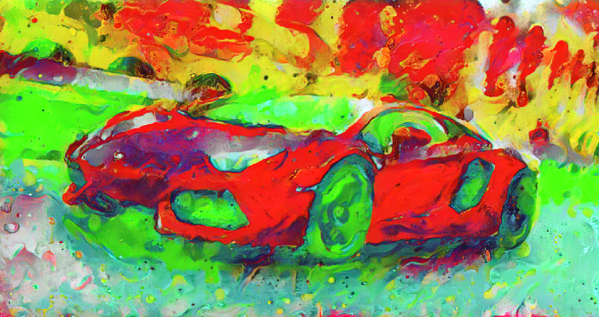
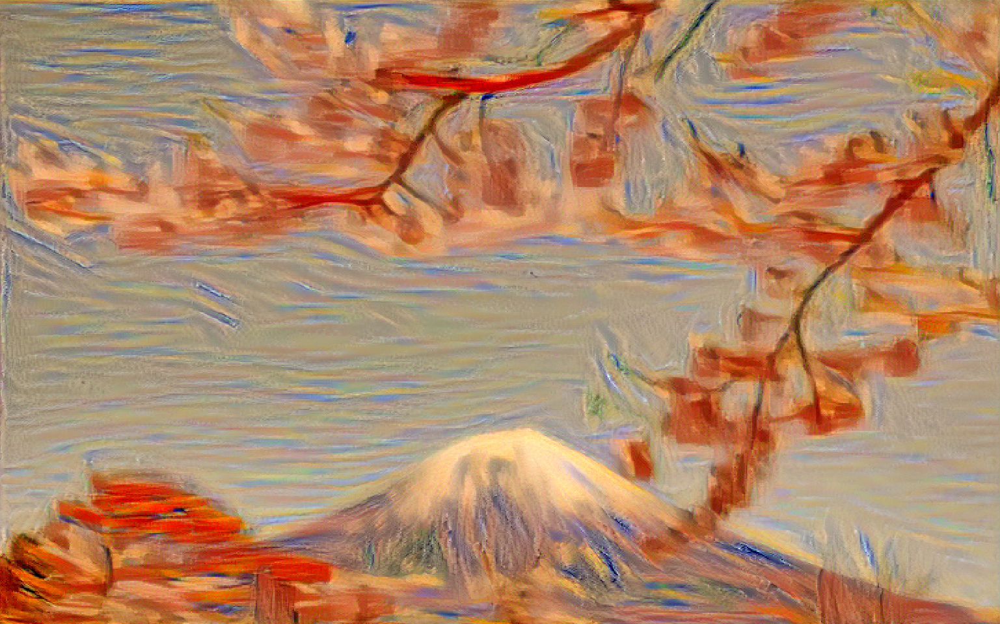
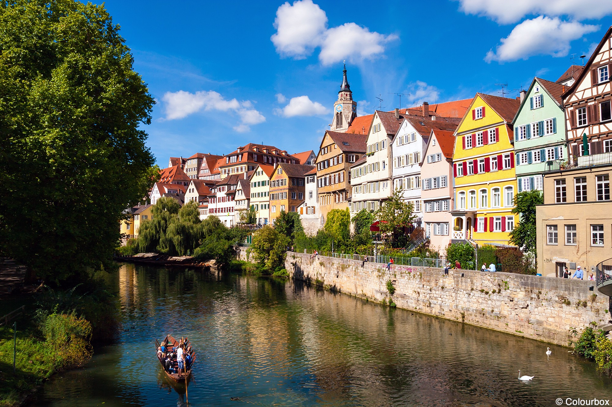
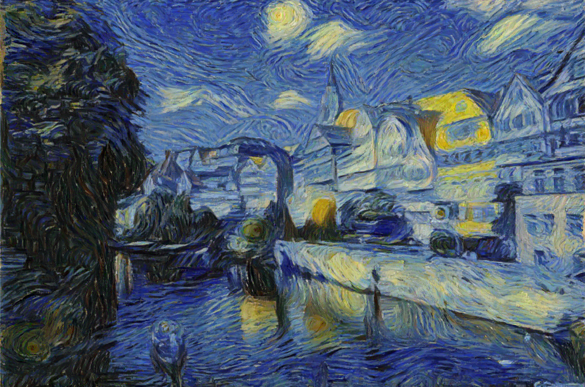

# Gatys_Style_Transfer_in_PyTorch
Performs style transfer between a content image and a style image as outlined in Gatys et al. (2016)

The script can be used from command line (python Gatys_Style_Transfer_LBFGS_Optimizer_Update.py). Just make sure to give the complete path to the image files when prompted (or just the name if they are in the same working directory).

A set of examples of style-transferred images using the code cotained in "Gatys_Style_Transfer_LBFGS_Optimizer_Update.py" can be seen below:

Content Image               |  Style Image                        | Style Transfer                                  |
----------------------------|-------------------------------------|-------------------------------------------------|
|||
    |           | |
 |          |       |

**NOTE** If you run the script from the command line, make sure you close the intermediate images that pop up while the script runs. These images are shown to display the style transfer progress as total loss decreases.

**Note** Gatys_Style_Transfer.py is deprecated. Kept here for archival purposes. If you want to use my code, please download and use Gatys_Style_Transfer_LBFGS_Optimizer_Update.py
